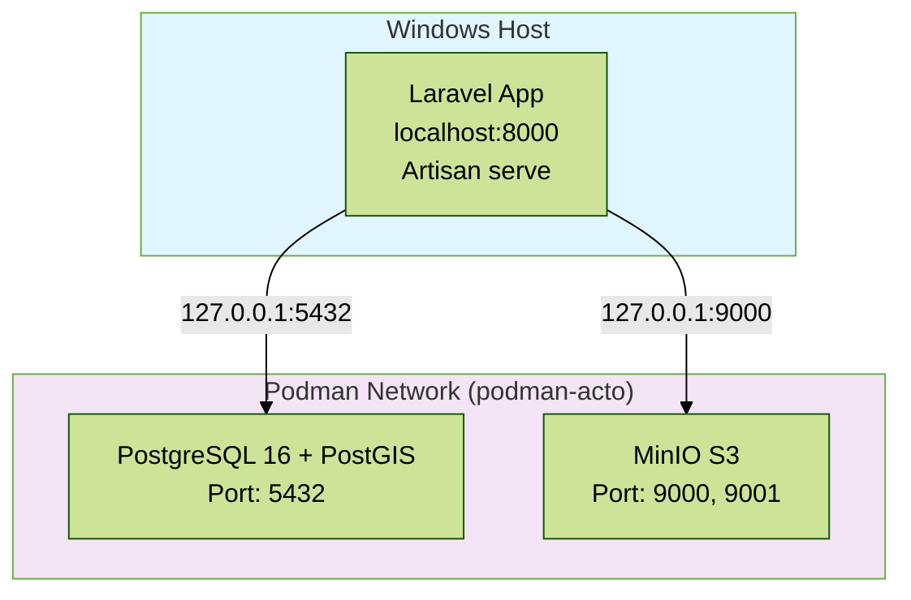

# Documentação de Infraestrutura

## 1. Visão Geral

Sistema híbrido com PostgreSQL e MinIO em containers Podman, enquanto Laravel roda localmente via Artisan para melhor performance no Windows.

## 2. Arquitetura de Implantação



## 3. Componentes

### 3.1 Laravel (Local via Artisan)

Execução: Local no Windows  
Porta: 8000  
Método: `php artisan serve`

Requisitos:
- PHP 8.2+ com extensões: pdo_pgsql, pgsql, mbstring, xml, bcmath, gd, zip, opcache
- Composer

Instalação:
```powershell
# Instalar dependências
composer install

# Copiar .env
cp .env.example .env

# Gerar key
php artisan key:generate

# Rodar migrações
php artisan migrate

# Iniciar servidor
php artisan serve --host=0.0.0.0 --port=8000
```

Configuração .env:
```env
APP_URL=http://localhost:8000

DB_CONNECTION=pgsql
DB_HOST=127.0.0.1
DB_PORT=5432
DB_DATABASE=laravel
DB_USERNAME=laravel_user
DB_PASSWORD=secret

AWS_ACCESS_KEY_ID=minioadmin
AWS_SECRET_ACCESS_KEY=minioadmin
AWS_DEFAULT_REGION=us-east-1
AWS_BUCKET=acto-maps
AWS_ENDPOINT=http://127.0.0.1:9000
AWS_USE_PATH_STYLE_ENDPOINT=true
```

### 3.2 PostgreSQL + PostGIS (Container)

Imagem: `postgis/postgis:16-3.4-alpine`  
Porta: 5432 (mapeada para host)  
Volume: `postgres_data`

Extensões:
- PostGIS 3.4 (habilitada via migrations)

Schemas criados:
- `auth` - Autenticação e autorização
- `geo` - Dados geográficos
- `security` - Segurança e auditoria  
- `storage` - Cache e filas

Configuração (podman-compose.yml):
```yaml
postgres:
  image: postgis/postgis:16-3.4-alpine
  container_name: acto-postgres
  environment:
    POSTGRES_DB: laravel
    POSTGRES_USER: laravel_user
    POSTGRES_PASSWORD: secret
    PGDATA: /var/lib/postgresql/data/postgres_data
  volumes:
    - postgres_data:/var/lib/postgresql/data
  ports:
    - "5432:5432"
  networks:
    - acto-network
  healthcheck:
    test: ["CMD-SHELL", "pg_isready -U laravel_user -d laravel"]
    interval: 10s
    timeout: 5s
    retries: 5
    start_period: 10s
  restart: unless-stopped
```

**Observação**: Não há script `init.sql`. Schemas, extensões e índices são criados via Laravel Migrations.

### 3.3 MinIO (Container)

Imagem: `minio/minio:latest`  
Portas:
- 9000: API
- 9001: Console UI

Volumes: `minio_data`

Configuração:
```yaml
minio:
  image: minio/minio:latest
  container_name: acto-minio
  command: server /data --console-address ":9001"
  environment:
    MINIO_ROOT_USER: minioadmin
    MINIO_ROOT_PASSWORD: minioadmin
  ports:
    - "9000:9000"
    - "9001:9001"
  volumes:
    - minio_data:/data
  networks:
    - podman-acto
  restart: unless-stopped
```

Acesso Console: http://localhost:9001  
User: minioadmin  
Password: minioadmin

### 3.4 Mintlify (Container)

Imagem: `node:20-alpine`  
Porta: 3000 (Documentação interativa)

Configuração:
```yaml
mintlify:
  image: node:20-alpine
  container_name: acto-mintlify
  working_dir: /docs
  command: sh -c "npm install -g mintlify && mintlify dev --host 0.0.0.0"
  volumes:
    - ./docs:/docs
  ports:
    - "3000:3000"
  networks:
    - podman-acto
  restart: unless-stopped
```

Acesso: http://localhost:3000

Funcionalidades:
- Documentação interativa e navegável
- Busca integrada
- Syntax highlighting
- Navegação por abas
- Dark mode
- Responsive design

### 3.5 Rede

Network: `podman-acto` (bridge)

Criação:
```powershell
podman network create podman-acto
```

## 4. Arquivo podman-compose.yml

```yaml
version: '3.8'

services:
  postgres:
    image: postgis/postgis:16-3.4
    container_name: acto-postgres
    environment:
      POSTGRES_DB: laravel
      POSTGRES_USER: laravel_user
      POSTGRES_PASSWORD: secret
      POSTGRES_INITDB_ARGS: "--encoding=UTF8 --locale=en_US.UTF-8"
    ports:
      - "5432:5432"
    volumes:
      - postgres_data:/var/lib/postgresql/data
      - ./docker/postgres/init.sql:/docker-entrypoint-initdb.d/init.sql
    networks:
      - podman-acto
    restart: unless-stopped
    healthcheck:
      test: ["CMD-SHELL", "pg_isready -U laravel_user -d laravel"]
      interval: 10s
      timeout: 5s
      retries: 5

  minio:
    image: minio/minio:latest
    container_name: acto-minio
    command: server /data --console-address ":9001"
    environment:
      MINIO_ROOT_USER: minioadmin
      MINIO_ROOT_PASSWORD: minioadmin
    ports:
      - "9000:9000"
      - "9001:9001"
    volumes:
      - minio_data:/data
    networks:
      - podman-acto
    restart: unless-stopped
    healthcheck:
      test: ["CMD", "curl", "-f", "http://localhost:9000/minio/health/live"]
      interval: 30s
      timeout: 20s
      retries: 3

networks:
  podman-acto:
    driver: bridge

volumes:
  postgres_data:
    driver: local
  minio_data:
    driver: local
```

## 5. Setup e Gerenciamento

### 5.1 Inicialização

Criar network:
```powershell
podman network create podman-acto
```

Iniciar containers:
```powershell
podman-compose up -d
```

Verificar status:
```powershell
podman-compose ps
```

Ver logs:
```powershell
podman-compose logs -f postgres
podman-compose logs -f minio
```

### 5.2 Configurar MinIO Bucket

Via Console (http://localhost:9001):
1. Login com minioadmin/minioadmin
2. Criar bucket: acto-maps
3. Definir Access Policy: public ou private

Via CLI:
```powershell
# Instalar mc (MinIO Client)
# https://min.io/docs/minio/windows/reference/minio-mc.html

# Configurar alias
mc alias set local http://localhost:9000 minioadmin minioadmin

# Criar bucket
mc mb local/acto-maps

# Definir política
mc anonymous set download local/acto-maps
```

### 5.3 Laravel Migrations

Rodar migrações:
```powershell
php artisan migrate
```

Seed inicial:
```powershell
php artisan db:seed
```

Criar primeiro admin:
```powershell
php artisan make:filament-user
```

### 5.4 Comandos Úteis

Parar containers:
```powershell
podman-compose stop
```

Reiniciar containers:
```powershell
podman-compose restart
```

Remover containers (mantém volumes):
```powershell
podman-compose down
```

Remover containers e volumes:
```powershell
podman-compose down -v
```

Limpar cache do Podman:
```powershell
podman system prune -a
```

## 6. Backup

### 6.1 Backup PostgreSQL

Manual:
```powershell
# Dump completo
podman exec acto-postgres pg_dump -U laravel_user laravel > backup.sql

# Dump compactado
podman exec acto-postgres pg_dump -U laravel_user laravel | gzip > backup.sql.gz

# Dump com formato custom (mais rápido para restore)
podman exec acto-postgres pg_dump -U laravel_user -Fc laravel > backup.dump
```

Automatizado (script PowerShell):
```powershell
# backup-db.ps1
$timestamp = Get-Date -Format "yyyy-MM-dd_HH-mm-ss"
$backupFile = "backup_$timestamp.sql.gz"
$backupPath = "C:\backups\postgres\$backupFile"

podman exec acto-postgres pg_dump -U laravel_user laravel | gzip > $backupPath

Write-Host "Backup criado: $backupPath"

# Remover backups antigos (manter últimos 7 dias)
Get-ChildItem "C:\backups\postgres\" -Filter "backup_*.sql.gz" | 
    Where-Object { $_.LastWriteTime -lt (Get-Date).AddDays(-7) } | 
    Remove-Item
```

Agendar com Task Scheduler:
```powershell
# Criar tarefa agendada (executar diariamente às 2 AM)
$action = New-ScheduledTaskAction -Execute "powershell.exe" -Argument "-File C:\scripts\backup-db.ps1"
$trigger = New-ScheduledTaskTrigger -Daily -At 2am
Register-ScheduledTask -Action $action -Trigger $trigger -TaskName "ACTO-PostgreSQL-Backup" -Description "Backup diário do banco ACTO"
```

### 6.2 Restore PostgreSQL

```powershell
# Restore de .sql
Get-Content backup.sql | podman exec -i acto-postgres psql -U laravel_user laravel

# Restore de .sql.gz
gunzip -c backup.sql.gz | podman exec -i acto-postgres psql -U laravel_user laravel

# Restore de .dump (custom format)
podman exec -i acto-postgres pg_restore -U laravel_user -d laravel -c backup.dump
```

### 6.3 Backup MinIO

Sincronizar bucket local:
```powershell
# Via MinIO Client
mc mirror local/acto-maps C:\backups\minio\acto-maps
```

Backup de volume:
```powershell
# Parar MinIO
podman-compose stop minio

# Copiar volume
podman volume export minio_data | gzip > minio_backup.tar.gz

# Reiniciar MinIO
podman-compose start minio
```

### 6.4 Restore MinIO

```powershell
# Parar MinIO
podman-compose stop minio

# Remover volume antigo
podman volume rm minio_data

# Criar novo volume
podman volume create minio_data

# Importar backup
gunzip -c minio_backup.tar.gz | podman volume import minio_data -

# Reiniciar MinIO
podman-compose start minio
```

## 7. Monitoramento

### 7.1 Health Checks

Verificar saúde dos containers:
```powershell
podman healthcheck run acto-postgres
podman healthcheck run acto-minio
```

### 7.2 Logs

Logs em tempo real:
```powershell
podman-compose logs -f
```

Logs específicos:
```powershell
podman logs acto-postgres --tail 100
podman logs acto-minio --tail 100
```

Logs do Laravel:
```powershell
Get-Content storage\logs\laravel.log -Tail 50 -Wait
```

### 7.3 Recursos

Uso de recursos dos containers:
```powershell
podman stats acto-postgres acto-minio
```

Espaço em disco:
```powershell
podman system df
```

## 8. Troubleshooting

### 8.1 PostgreSQL não conecta

Verificar se container está rodando:
```powershell
podman ps | Select-String "acto-postgres"
```

Verificar logs:
```powershell
podman logs acto-postgres --tail 50
```

Testar conexão:
```powershell
podman exec acto-postgres psql -U laravel_user -d laravel -c "SELECT version();"
```

Verificar porta:
```powershell
netstat -an | Select-String "5432"
```

### 8.2 MinIO não acessível

Verificar container:
```powershell
podman ps | Select-String "acto-minio"
```

Verificar logs:
```powershell
podman logs acto-minio --tail 50
```

Testar API:
```powershell
curl http://localhost:9000/minio/health/live
```

### 8.3 Laravel não conecta ao banco

Verificar .env:
```env
DB_HOST=127.0.0.1  # NÃO usar localhost
DB_PORT=5432
```

Limpar cache de config:
```powershell
php artisan config:clear
php artisan cache:clear
```

Testar conexão:
```powershell
php artisan tinker
>>> DB::connection()->getPdo();
```

### 8.4 Porta já em uso

Verificar processo usando a porta:
```powershell
netstat -ano | Select-String ":5432"
netstat -ano | Select-String ":9000"
```

Matar processo (se necessário):
```powershell
Stop-Process -Id <PID> -Force
```

Ou mudar porta no podman-compose.yml:
```yaml
ports:
  - "5433:5432"  # Usar porta alternativa no host
```

### 8.5 Performance lenta no Windows

Recomendação: Laravel local + serviços em containers (setup atual)

Se ainda estiver lento:
- Desabilitar antivírus para diretório do projeto
- Usar SSD ao invés de HDD
- Aumentar recursos do WSL2 (se aplicável)
- Considerar usar PostgreSQL nativo no Windows

## 9. Segurança

### 9.1 Produção

Alterar senhas padrão:
```yaml
# PostgreSQL
POSTGRES_PASSWORD: use_strong_password_here

# MinIO
MINIO_ROOT_USER: custom_user
MINIO_ROOT_PASSWORD: custom_strong_password
```

### 9.2 Network Isolation

Em produção, não expor portas:
```yaml
postgres:
  # Remover 'ports:' - apenas acesso interno via network
  expose:
    - "5432"
```

### 9.3 Firewall

Bloquear acesso externo:
```powershell
# Windows Firewall - bloquear portas de desenvolvimento
New-NetFirewallRule -DisplayName "Block-Postgres" -Direction Inbound -LocalPort 5432 -Protocol TCP -Action Block
New-NetFirewallRule -DisplayName "Block-MinIO" -Direction Inbound -LocalPort 9000 -Protocol TCP -Action Block
```

## 10. Migração para Produção

### 10.1 Considerações

Desenvolvimento (atual):
- Laravel: Local via Artisan
- PostgreSQL + MinIO: Containers Podman

Produção (recomendado):
- Laravel: Nginx + PHP-FPM em container ou VM
- PostgreSQL: Serviço gerenciado (AWS RDS, Azure Database) ou container otimizado
- MinIO: Cluster distribuído ou S3 nativo

### 10.2 Checklist

- [ ] Alterar APP_DEBUG=false
- [ ] Gerar nova APP_KEY
- [ ] Configurar HTTPS/SSL
- [ ] Alterar senhas de banco e storage
- [ ] Configurar backups automáticos
- [ ] Configurar logs centralizados
- [ ] Implementar monitoramento (Prometheus/Grafana)
- [ ] Configurar cache (Redis)
- [ ] Habilitar opcache do PHP
- [ ] Otimizar configurações do PostgreSQL
- [ ] Configurar CDN para assets estáticos
