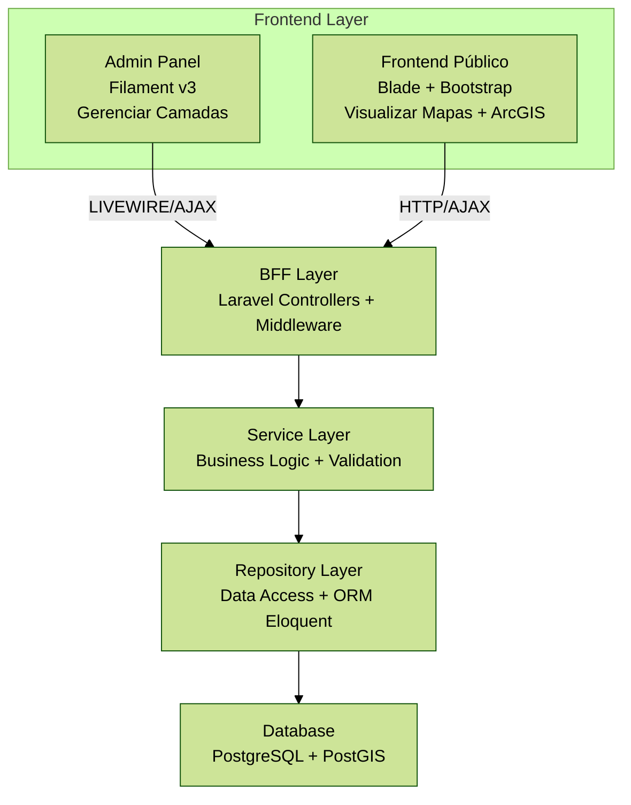

# Technical Requirements Document (TRD)

## 1. Arquitetura

### 1.1 Padrão Arquitetural
- BFF (Backend for Frontend): API específica para necessidades do frontend
- SOLID Principles: Garantir código manutenível e extensível
- KISS (Keep It Simple): Evitar over-engineering

### 1.2 Estrutura de Camadas



## 2. Stack Tecnológico

### 2.1 Backend
- PHP: 8.2+
- Framework: Laravel 12
- ORM: Eloquent
- Autenticação: Laravel Fortify + Laravel Permissions + 2FA (TOTP)
- Admin Panel: Filament v4
- Notificações: Evolution API v2 (WhatsApp)

### 2.2 Frontend

#### Admin Panel (Área Administrativa)
- Framework: Filament v4
- Características:
  - Interface moderna e responsiva (Tailwind CSS)
  - CRUD automático para camadas
  - Formulários com validação
  - Tabelas com filtros, busca e ordenação
  - Dashboard com widgets
  - Sistema de notificações
  - Dark mode nativo
  - Multi-idioma

#### Frontend Público (Visualização de Mapas)
- Template Engine: Blade
- CSS Framework: Bootstrap 5
- JavaScript: jQuery + Vanilla JS
- Maps: ArcGIS Maps SDK for JavaScript v4
- Características:
  - Interface pública para visualização de mapas
  - Interação com camadas
  - Design responsivo e moderno

### 2.3 Banco de Dados
- RDBMS: PostgreSQL 16+ com extensão PostGIS
- Características:
  - ACID compliant
  - Suporte a tipos geométricos (POINT, LINESTRING, POLYGON)
  - Índices espaciais (GIST)

### 2.4 Storage
- Object Storage: MinIO (S3-compatible)
- Armazenamento de arquivos de camadas e metadados

### 2.5 Containerização
- Engine: Podman
- Orchestration: Podman Compose

## 3. Estrutura de Diretórios

```
Teste_ACTO/
├── app/
│   ├── Filament/                      # ADMIN PANEL (Filament v3)
│   │   ├── Resources/
│   │   │   ├── LayerResource.php      # CRUD de camadas
│   │   │   └── UserResource.php       # CRUD de usuários
│   │   ├── Pages/
│   │   │   └── Dashboard.php          # Dashboard customizado
│   │   └── Widgets/
│   │       └── StatsOverview.php      # Widgets do dashboard
│   ├── Http/
│   │   ├── Controllers/
│   │   │   ├── API/
│   │   │   │   └── LayerController.php    # API REST
│   │   │   └── MapController.php          # Frontend público
│   │   └── Middleware/
│   │       ├── CheckRole.php
│   │       └── Check2FA.php
│   ├── Models/
│   │   ├── User.php
│   │   └── Layer.php
│   ├── Repositories/
│   │   └── LayerRepository.php
│   ├── Services/
│   │   └── LayerService.php
│   └── Helpers/
│       └── helpers.php
├── database/
│   ├── migrations/
│   └── seeders/
├── docs/
├── public/
│   ├── js/
│   │   └── map.js                     # Frontend público
│   └── css/
│       └── app.css
├── resources/
│   └── views/
│       ├── layouts/
│       │   └── app.blade.php          # Layout base
│       ├── map/
│       │   └── index.blade.php        # Visualização de mapas
│       └── welcome.blade.php          # Homepage
├── routes/
│   ├── web.php                        # Rotas públicas
│   └── api.php                        # Rotas API
├── tests/
│   ├── Unit/
│   └── Feature/
├── podman-compose.yml
├── .env.example
└── README.md
```

## 4. Banco de Dados

### 4.1 Tabelas Principais

#### users
```sql
- id (bigint, PK)
- name (varchar)
- email (varchar, unique)
- password (varchar) -- Argon2ID hash
- two_factor_secret (text, nullable)
- two_factor_recovery_codes (text, nullable)
- timestamps
```

#### roles & permissions
- Gerenciadas pelo Laravel Permission (spatie/laravel-permission)

#### layers
```sql
- id (bigint, PK)
- name (varchar, indexed)
- description (text)
- type (enum: 'point', 'line', 'polygon')
- source (varchar) -- URL or file reference
- geometry (geometry) -- PostGIS type
- metadata (jsonb)
- is_active (boolean, default: true, indexed)
- created_by (bigint, FK -> users.id)
- timestamps
- Indexes: (name), (is_active), (created_by), GIST(geometry)
```

## 5. APIs

### 5.1 Endpoints Principais

#### GET /api/layers
Descrição: Retorna todas as camadas ativas em formato GeoJSON

Response:
```json
{
  "type": "FeatureCollection",
  "features": [
    {
      "type": "Feature",
      "id": 1,
      "properties": {
        "name": "Camada 1",
        "description": "Descrição",
        "type": "polygon"
      },
      "geometry": {
        "type": "Polygon",
        "coordinates": [[...]]
      }
    }
  ]
}
```

#### POST /api/layers (Admin only)
Descrição: Cria nova camada

#### PUT /api/layers/{id} (Admin only)
Descrição: Atualiza camada

#### DELETE /api/layers/{id} (Admin only)
Descrição: Remove camada

## 6. Segurança

### 6.1 Autenticação
- Laravel Sanctum para API tokens
- Session-based auth para web
- 2FA usando TOTP (Google Authenticator compatible)

### 6.2 Autorização
- Middleware de roles (admin, operator, viewer)
- Policies para controle granular de acesso

### 6.3 Criptografia
- Senhas: Argon2ID
- Secrets 2FA: encrypted
- Comunicação: HTTPS only (produção)

## 7. Performance

### 7.1 Otimizações
- Query Builder com índices apropriados
- Eager Loading para relacionamentos
- Cache de camadas frequentemente acessadas (Redis/File)
- Paginação de resultados

### 7.2 Métricas
- Response time < 500ms
- Database queries < 10 por request
- Memory usage < 128MB por request

## 8. Testes

### 8.1 Estratégia
- Unit Tests: Models, Services, Repositories (Pest PHP)
- Feature Tests: Controllers, API endpoints
- E2E Tests: User flows (Laravel Dusk/Playwright)
- Load Tests: JMeter para APIs

### 8.2 Cobertura Mínima
- Services: 90%
- Controllers: 80%
- Models: 70%

## 9. Deployment

### 9.1 Ambientes
- Local: Podman Compose
- Staging: Container registry + Podman
- Production: Kubernetes ou Podman em VMs

### 9.2 CI/CD
- GitHub Actions ou GitLab CI
- Pipeline: lint → test → build → deploy

## 10. Dependências Principais

```json
{
  "laravel/framework": "^12.0",
  "laravel/fortify": "^1.0",
  "spatie/laravel-permission": "^6.0",
  "filament/filament": "^4.0",
  "pestphp/pest": "^2.0"
}
```
