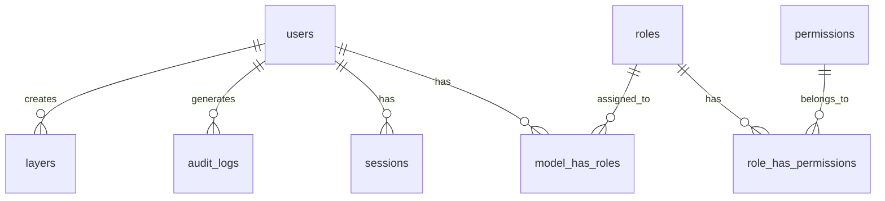

# Database Schema

## Visão Geral

O banco de dados utiliza PostgreSQL 16 com extensão PostGIS 3.4 para suporte a dados geoespaciais.

## Extensões

- PostGIS 3.4: Tipos e funções geoespaciais
- pg_trgm: Full-text search
- uuid-ossp: Geração de UUIDs

## Diagrama ER

Veja o arquivo completo: [database.dbml](/database.dbml)

## Tabelas Principais

### users

Tabela de usuários do sistema.

| Coluna | Tipo | Descrição |
|--------|------|-----------|
| id | bigserial | PK |
| name | varchar(255) | Nome do usuário |
| email | varchar(255) | Email único |
| password | varchar(255) | Hash Argon2ID |
| two_factor_secret | text | Secret TOTP criptografado |
| two_factor_recovery_codes | text | Códigos de recuperação |
| created_at | timestamp | Data de criação |
| updated_at | timestamp | Data de atualização |

Índices:
- `idx_users_email` (email)
- `idx_users_created` (created_at)

### roles

Tabela de roles (Laravel Permission).

| Coluna | Tipo | Descrição |
|--------|------|-----------|
| id | bigserial | PK |
| name | varchar(255) | Nome da role |
| guard_name | varchar(255) | Guard (web) |
| created_at | timestamp | Data de criação |
| updated_at | timestamp | Data de atualização |

Roles padrão:
- `admin`: Acesso total
- `operator`: CRUD de camadas
- `viewer`: Apenas leitura

### permissions

Tabela de permissões.

| Coluna | Tipo | Descrição |
|--------|------|-----------|
| id | bigserial | PK |
| name | varchar(255) | Nome da permissão |
| guard_name | varchar(255) | Guard (web) |

Permissões:
- `view_layer`
- `create_layer`
- `edit_layer`
- `delete_layer`
- `manage_users`

### layers

Tabela principal de camadas geoespaciais.

| Coluna | Tipo | Descrição |
|--------|------|-----------|
| id | bigserial | PK |
| name | varchar(255) | Nome da camada |
| description | text | Descrição |
| type | varchar(50) | Tipo: point, line, polygon |
| source | varchar(500) | URL ou path S3 |
| geometry | geometry | Geometria PostGIS |
| metadata | jsonb | Metadados adicionais |
| is_active | boolean | Status ativo/inativo |
| created_by | bigint | FK -> users.id |
| created_at | timestamp | Data de criação |
| updated_at | timestamp | Data de atualização |
| deleted_at | timestamp | Soft delete |

Índices:
- `idx_layers_name` (name)
- `idx_layers_is_active` (is_active)
- `idx_layers_created_by` (created_by)
- `idx_layers_geometry_gist` GIST (geometry)
- `idx_layers_created_at` (created_at)
- `idx_layers_deleted_at` (deleted_at)

### sessions

Tabela de sessões.

| Coluna | Tipo | Descrição |
|--------|------|-----------|
| id | varchar(255) | PK |
| user_id | bigint | FK -> users.id |
| ip_address | varchar(45) | IP do usuário |
| user_agent | text | User agent |
| payload | text | Dados da sessão |
| last_activity | integer | Timestamp última atividade |

### audit_logs

Tabela de auditoria.

| Coluna | Tipo | Descrição |
|--------|------|-----------|
| id | bigserial | PK |
| user_id | bigint | FK -> users.id |
| action | varchar(50) | create, update, delete, view |
| model | varchar(100) | Nome do model |
| model_id | bigint | ID do registro |
| old_values | jsonb | Valores antigos |
| new_values | jsonb | Valores novos |
| ip_address | inet | IP do usuário |
| user_agent | text | User agent |
| created_at | timestamp | Data da ação |

Índices:
- `idx_audit_user` (user_id)
- `idx_audit_model` (model, model_id)
- `idx_audit_created` (created_at)
- `idx_audit_action` (action)

### personal_access_tokens

Tabela de tokens API (Laravel Sanctum).

| Coluna | Tipo | Descrição |
|--------|------|-----------|
| id | bigserial | PK |
| tokenable_type | varchar(255) | Tipo do model |
| tokenable_id | bigint | ID do model |
| name | varchar(255) | Nome do token |
| token | varchar(64) | Hash do token |
| abilities | text | Permissões JSON |
| last_used_at | timestamp | Último uso |
| expires_at | timestamp | Expiração |

## Relacionamentos



## Queries PostGIS Comuns

### Buscar camadas dentro de bounding box

```sql
SELECT * FROM layers
WHERE ST_Intersects(
  geometry,
  ST_MakeEnvelope(-48.0, -16.0, -47.8, -15.5, 4326)
)
AND is_active = true;
```

### Calcular área de polígono

```sql
SELECT 
  name,
  ST_Area(ST_Transform(geometry, 3857)) as area_m2
FROM layers
WHERE type = 'polygon';
```

### Distância entre pontos

```sql
SELECT 
  l1.name as origin,
  l2.name as destination,
  ST_Distance(
    ST_Transform(l1.geometry, 3857),
    ST_Transform(l2.geometry, 3857)
  ) as distance_m
FROM layers l1, layers l2
WHERE l1.type = 'point' AND l2.type = 'point';
```

### Simplificar geometria

```sql
UPDATE layers
SET geometry = ST_Simplify(geometry, 0.001)
WHERE type IN ('linestring', 'polygon');
```

## Migrations

As migrations estão em `database/migrations/`.

Executar migrations:

```bash
php artisan migrate
```

Rollback:

```bash
php artisan migrate:rollback
```

Refresh (reset + migrate):

```bash
php artisan migrate:refresh
```

## Seeders

Popular banco com dados de teste:

```bash
php artisan db:seed
```

Seeds disponíveis:
- `RolePermissionSeeder`: Roles e permissões
- `UserSeeder`: Usuários de teste
- `LayerSeeder`: Camadas de exemplo

## Backup

Ver documentação em [Infradoc.md](/technical/Infradoc#backup)

## Performance

### Índices

Todos os campos frequentemente buscados possuem índices:
- Chaves estrangeiras
- Campos de filtro (is_active, type)
- Campos de ordenação (created_at)
- Geometrias (GIST index)

### Vacuum

Executar periodicamente:

```bash
podman exec acto-postgres vacuumdb -U laravel_user -d laravel --analyze --verbose
```

### Análise de Performance

```sql
EXPLAIN ANALYZE
SELECT * FROM layers
WHERE ST_Intersects(geometry, ST_MakeEnvelope(...));
```

