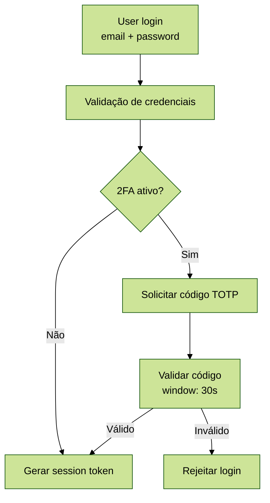

# Documentação de Segurança

## 1. Visão Geral

Este documento descreve controles de segurança, políticas e práticas implementadas no sistema.

## 2. Autenticação

### 2.1 Password Hashing

Algoritmo: Argon2ID (padrão Laravel 12)

Configuração:
```php
// config/hashing.php
'driver' => 'argon2id',
'argon' => [
    'memory' => 65536,  // 64 MB
    'threads' => 1,
    'time' => 4,
],
```

Características:
- Resistente a ataques de GPU e ASIC
- Proteção contra side-channel attacks
- Memory-hard function

### 2.2 Autenticação de Dois Fatores (2FA)

Implementação: Laravel Fortify + TOTP

Requisitos:
- Obrigatório para role: admin
- Opcional para roles: operator, viewer
- Compatível com Google Authenticator, Authy, Microsoft Authenticator

Recovery Codes:
- 8 códigos de backup gerados
- Uso único
- Armazenados criptografados

Fluxo:



### 2.3 Session Management

Configuração:
```env
SESSION_DRIVER=database
SESSION_LIFETIME=120  # 2 hours
SESSION_SECURE_COOKIE=true  # Production
SESSION_HTTP_ONLY=true
SESSION_SAME_SITE=lax
```

Regeneração de Session:
- Após login bem-sucedido
- Após mudança de password
- Após elevação de privilégios

## 3. Autorização

### 3.1 Roles e Permissions

Roles Definidas:

| Role | Descrições | Permissões |
|------|-----------|-----------|
| admin | Administrador do sistema | Todas as permissões |
| operator | Operador com acesso de edição | create_layer, edit_layer, view_layer |
| viewer | Visualizador apenas | view_layer, view_map |

Permissions:
- view_layer: Visualizar camadas
- create_layer: Criar novas camadas
- edit_layer: Editar camadas existentes
- delete_layer: Excluir camadas
- manage_users: Gerenciar usuários (admin only)

Implementação:
```php
// Check permission
if ($user->can('create_layer')) {
    // Allow creation
}

// Check role
if ($user->hasRole('admin')) {
    // Admin access
}

// Middleware
Route::middleware(['auth', 'role:admin'])->group(function () {
    // Admin routes
});
```

### 3.2 Policies

LayerPolicy:
```php
class LayerPolicy
{
    public function view(User $user, Layer $layer): bool
    {
        return $user->can('view_layer');
    }

    public function create(User $user): bool
    {
        return $user->can('create_layer');
    }

    public function update(User $user, Layer $layer): bool
    {
        return $user->can('edit_layer') && 
               ($layer->created_by === $user->id || $user->hasRole('admin'));
    }

    public function delete(User $user, Layer $layer): bool
    {
        return $user->can('delete_layer') && $user->hasRole('admin');
    }
}
```

## 4. Proteção de API

### 4.1 API Authentication

Método: Laravel Sanctum (SPA Authentication + API Tokens)

Token Types:
- Session Token: Para SPA (frontend Blade)
- API Token: Para integrações externas

Configuração:
```php
// Sanctum middleware
Route::middleware('auth:sanctum')->get('/api/layers', [LayerController::class, 'index']);
```

### 4.2 Rate Limiting

Configuração:
```php
// routes/api.php
RateLimiter::for('api', function (Request $request) {
    return Limit::perMinute(60)->by($request->user()?->id ?: $request->ip());
});

// Admin routes - stricter
RateLimiter::for('admin-api', function (Request $request) {
    return Limit::perMinute(30)->by($request->user()?->id);
});
```

Limites:
- API pública: 60 req/min por IP
- API autenticada: 100 req/min por usuário
- Admin API: 30 req/min

### 4.3 CORS

Configuração:
```php
// config/cors.php
'paths' => ['api/*', 'sanctum/csrf-cookie'],
'allowed_methods' => ['GET', 'POST', 'PUT', 'PATCH', 'DELETE'],
'allowed_origins' => [env('FRONTEND_URL', 'http://localhost:8000')],
'allowed_headers' => ['Content-Type', 'Authorization', 'X-Requested-With'],
'exposed_headers' => [],
'max_age' => 0,
'supports_credentials' => true,
```

## 5. Proteção de Dados

### 5.1 Criptografia

Database Encryption:
```php
// Model attribute casting
protected $casts = [
    'two_factor_secret' => 'encrypted',
    'two_factor_recovery_codes' => 'encrypted',
    'metadata' => 'encrypted:array',
];
```

Storage Encryption:
- MinIO: Server-Side Encryption (SSE-S3)
- Arquivos sensíveis: Client-side encryption antes do upload

### 5.2 Sanitização de Input

Validação:
```php
// LayerRequest.php
public function rules(): array
{
    return [
        'name' => 'required|string|max:255|regex:/^[a-zA-Z0-9\s\-_]+$/',
        'description' => 'nullable|string|max:1000',
        'type' => 'required|in:point,line,polygon',
        'geometry' => 'required|json',
    ];
}

public function prepareForValidation()
{
    $this->merge([
        'name' => strip_tags($this->name),
        'description' => strip_tags($this->description),
    ]);
}
```

SQL Injection Protection:
- Eloquent ORM (prepared statements)
- Query Builder com bindings
- Nunca usar raw queries com input do usuário

XSS Protection:
- Blade escaping automático: {{ $var }}
- Sanitização de HTML: usar htmlspecialchars()
- CSP headers configurados

### 5.3 CSRF Protection

Laravel CSRF:
```blade
<!-- Blade form -->
<form method="POST" action="/layers">
    @csrf
    <!-- form fields -->
</form>
```

AJAX Requests:
```javascript
// jQuery setup
$.ajaxSetup({
    headers: {
        'X-CSRF-TOKEN': $('meta[name="csrf-token"]').attr('content')
    }
});
```

## 6. Segurança de Banco de Dados

### 6.1 Acesso ao Banco

Princípio do Menor Privilégio:
```sql
-- User da aplicação
CREATE USER laravel_user WITH PASSWORD 'strong_password';
GRANT CONNECT ON DATABASE laravel TO laravel_user;
GRANT USAGE ON SCHEMA public TO laravel_user;
GRANT SELECT, INSERT, UPDATE, DELETE ON ALL TABLES IN SCHEMA public TO laravel_user;
GRANT USAGE, SELECT ON ALL SEQUENCES IN SCHEMA public TO laravel_user;

-- Negar DROP e TRUNCATE
REVOKE DROP, TRUNCATE ON ALL TABLES IN SCHEMA public FROM laravel_user;
```

### 6.2 Soft Deletes

Implementação:
```php
// Model Layer
use SoftDeletes;

protected $dates = ['deleted_at'];

// Query sempre exclui soft-deleted
Layer::all();

// Incluir soft-deleted
Layer::withTrashed()->get();
```

### 6.3 Audit Logging

Tabela de Auditoria:
```sql
CREATE TABLE audit_logs (
    id BIGSERIAL PRIMARY KEY,
    user_id BIGINT REFERENCES users(id),
    action VARCHAR(50) NOT NULL,
    model VARCHAR(100) NOT NULL,
    model_id BIGINT,
    old_values JSONB,
    new_values JSONB,
    ip_address INET,
    user_agent TEXT,
    created_at TIMESTAMP DEFAULT NOW()
);

CREATE INDEX idx_audit_user ON audit_logs(user_id);
CREATE INDEX idx_audit_model ON audit_logs(model, model_id);
CREATE INDEX idx_audit_created ON audit_logs(created_at);
```

## 7. Segurança de Arquivos

### 7.1 Upload de Arquivos

Validação:
```php
$request->validate([
    'file' => 'required|file|mimes:geojson,json,kml,shp|max:10240',
]);
```

Storage Seguro:
```php
// Armazenar fora do webroot
$path = $request->file('layer_file')->store('layers', 's3');

// Gerar nome único
$filename = Str::uuid() . '.' . $request->file('layer_file')->extension();
```

### 7.2 Acesso a Arquivos

URL Signing:
```php
// Gerar URL temporária (válida por 1 hora)
$url = Storage::disk('s3')->temporaryUrl(
    'layers/file.geojson',
    now()->addHour()
);
```

## 8. Headers de Segurança

Middleware de Headers:
```php
// app/Http/Middleware/SecurityHeaders.php
public function handle($request, Closure $next)
{
    $response = $next($request);
    
    $response->headers->set('X-Content-Type-Options', 'nosniff');
    $response->headers->set('X-Frame-Options', 'SAMEORIGIN');
    $response->headers->set('X-XSS-Protection', '1; mode=block');
    $response->headers->set('Referrer-Policy', 'strict-origin-when-cross-origin');
    $response->headers->set('Permissions-Policy', 'geolocation=(), microphone=(), camera=()');
    
    // CSP
    $response->headers->set('Content-Security-Policy', 
        "default-src 'self'; " .
        "script-src 'self' 'unsafe-inline' https://js.arcgis.com; " .
        "style-src 'self' 'unsafe-inline' https://js.arcgis.com; " .
        "img-src 'self' data: https://*.arcgis.com; " .
        "font-src 'self' https://js.arcgis.com;"
    );
    
    return $response;
}
```

## 9. Monitoramento e Detecção

### 9.1 Failed Login Attempts

Rate Limiting:
```php
// config/fortify.php
'limiters' => [
    'login' => 'login',
],

// RouteServiceProvider
RateLimiter::for('login', function (Request $request) {
    return Limit::perMinute(5)->by($request->email . $request->ip());
});
```

### 9.2 Detecção de Anomalias

Indicadores:
- Múltiplos IPs para mesmo usuário em curto período
- Acessos fora do horário habitual
- Mudanças frequentes de senha
- Acesso a recursos não usuais

## 10. Backup e Recuperação

### 10.1 Estratégia de Backup

Frequência:
- Full Backup: Diário (2 AM)
- Incremental Backup: A cada 6 horas
- Retenção: 30 dias

Scope:
- Database (PostgreSQL dump)
- Storage files (MinIO)
- Configurations (.env, configs)
- Logs

Criptografia:
```powershell
# Backup criptografado
podman-compose exec postgres pg_dump -U laravel_user laravel | \
  gpg --encrypt --recipient admin@example.com > backup_encrypted.sql.gpg
```

### 10.2 Disaster Recovery Plan

RTO (Recovery Time Objective): 4 horas  
RPO (Recovery Point Objective): 6 horas

Procedimento:
1. Identificar incidente
2. Isolar sistemas afetados
3. Avaliar extensão do dano
4. Restaurar do último backup válido
5. Verificar integridade dos dados
6. Reativar sistema
7. Análise post-mortem

## 11. Compliance e Conformidade

### 11.1 LGPD (Lei Geral de Proteção de Dados)

Consentimento:
- Coletar apenas dados necessários
- Informar propósito da coleta
- Permitir opt-out

Direitos do Usuário:
- Acesso aos dados pessoais
- Correção de dados incorretos
- Exclusão de dados (direito ao esquecimento)
- Portabilidade de dados

Implementação:
```php
// Controller para exportar dados do usuário
public function exportData(Request $request)
{
    $user = $request->user();
    
    $data = [
        'user' => $user->toArray(),
        'layers' => $user->layers()->get(),
        'audit_logs' => AuditLog::where('user_id', $user->id)->get(),
    ];
    
    return response()->json($data)
        ->header('Content-Disposition', 'attachment; filename="user_data.json"');
}
```

### 11.2 Logs de Acesso

Retenção: 6 meses  
Conteúdo: User ID, IP, Action, Timestamp, Resource

## 12. Segurança em Produção

### 12.1 Checklist

- [ ] APP_DEBUG=false
- [ ] HTTPS only (SSL/TLS 1.3)
- [ ] Firewall configurado (apenas portas 80, 443)
- [ ] SSH com chave pública (desabilitar password)
- [ ] Atualizar sistema operacional regularmente
- [ ] Atualizar dependências PHP/JS
- [ ] Configurar WAF (Web Application Firewall)
- [ ] Implementar IDS/IPS
- [ ] Backups automáticos testados
- [ ] Monitoramento 24/7 ativo
- [ ] Incident response plan documentado

### 12.2 Hardening

Sistema Operacional:
- Desabilitar serviços desnecessários
- Configurar SELinux/AppArmor
- Limitar usuários com sudo

Containers:
- Usar imagens oficiais e verificadas
- Rodar containers como non-root
- Limitar recursos (CPU, memória)
- Escanear imagens com Trivy

Aplicação:
- Remover arquivos de desenvolvimento (.git, tests)
- Desabilitar rotas de debug
- Configurar opcache

## 13. Incident Response

### 13.1 Plano de Resposta

Fase 1 - Detecção (0-30 min):
- Identificar tipo de incidente
- Avaliar gravidade (Critical, High, Medium, Low)

Fase 2 - Contenção (30 min - 2h):
- Isolar sistemas afetados
- Preservar evidências
- Bloquear acesso malicioso

Fase 3 - Erradicação (2-8h):
- Remover causa raiz
- Aplicar patches
- Atualizar regras de firewall

Fase 4 - Recuperação (8-24h):
- Restaurar sistemas
- Validar integridade
- Monitoramento intensivo

Fase 5 - Lições Aprendidas (1-3 dias):
- Documentar incidente
- Atualizar procedimentos
- Treinamento da equipe

## 14. Contatos de Emergência

- Security Lead: security@example.com
- DevOps: devops@example.com
- Suporte 24/7: +55 11 9999-9999
